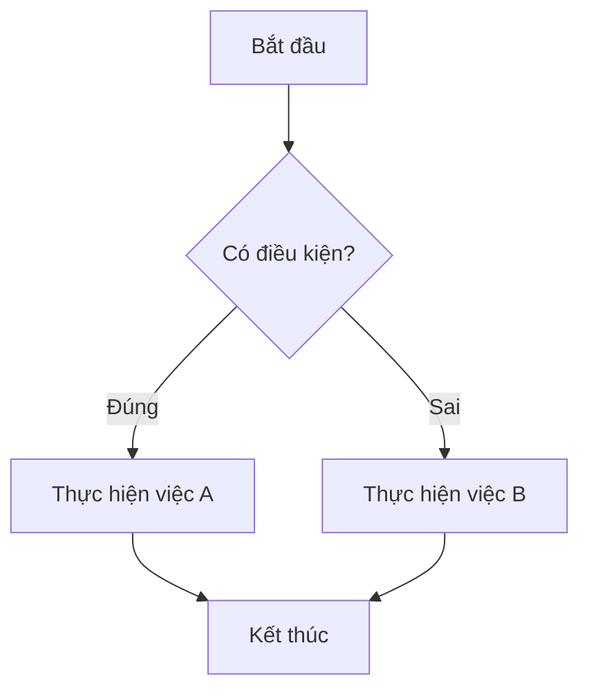

<details>
<summary>Unity buổi 1,2 (26/8/2026)</summary>
<details style="margin-left: 20px;">
<summary>Tóm tắt bài cũ</summary>

* # Tóm tắt bài cũ
### Sử dụng gifhub:
ưu điểm: quản lí phiên bản, làm dự án nhóm, commit code public, backup khi lỗi, deloy dự án, tham khảo dự án công khai ...)  

<div style="padding: 20px; border: 1px solid #ffffff;">
1. tạo repostory (repo) <br>
2. Save dự án của mình về exploser  <br>
3. Dùng cmd hoặc UI app thứ 3 (cần có git) để commit toàn bộ dự án của mình và push lên github
</div>
<br>
<div style="padding: 20px; border: 1px solid #ffffff;">
<b>Commit</b> : Lưu từng phiên bản, dễ dàng so sánh dự án đã update thứ gì so với trước, dễ dàng backup quay  về khi lỗi <br><br>
<b>push:</b> Đẩy lên github, cài lại win không lo mất dự án
</div>
<br>

----

### Access Modifiers
Trong Unity, Access Modifiers (phạm vi truy cập) quy định đối tượng nào được phép đọc hoặc sửa dữ liệu:  

<b> public </b>: Cho phép bất kỳ class nào bên ngoài cũng có thể gọi và chỉnh sửa. Trong Unity, biến public cũng sẽ hiển thị trực tiếp lên bảng Inspector.  

<b> private:</b> Chỉ nội bộ bên trong class đó mới được phép thấy và can thiệp. Class khác hoàn toàn bị chặn truy cập.


```C#
using UnityEngine;

public class PlayerStats : MonoBehaviour
{
    // 1. PUBLIC: Hiển thị trên Inspector, class khác sửa thoải mái
    public string playerName = "Chiến Binh";
    public int atk = 25; 

    // 2. PRIVATE: Bị giấu kín, bên ngoài không thể tự ý sửa
    private int currentHp = 100;
    private int maxHp = 100;

    // 3. PUBLIC FUNCTION: Cung cấp "cổng kiểm soát" để class khác tương tác an toàn
    public void TakeDamage(int damageReceived)
    {
        // Kiểm soát logic trước khi trừ máu
        currentHp -= damageReceived;

        // Đảm bảo máu không âm
        if (currentHp < 0)
        {
            currentHp = 0;
        }

        Debug.Log(playerName + " bị đánh! Máu còn lại: " + currentHp + "/" + maxHp);

        if (currentHp == 0)
        {
            Die();
        }
    }

    // 4. PRIVATE FUNCTION: Chỉ nội bộ Player tự chạy khi hết máu
    private void Die()
    {
        Debug.Log(playerName + " đã bị hạ gục!");
    }

    // Hàm public chỉ để đọc máu hiện tại (không cho class khác tự gán giá trị bừa bãi)
    public int GetCurrentHp()
    {
        return currentHp;
    }
}
```
```C#
using UnityEngine;

public class PlayerStats : MonoBehaviour
{
    // Biến private: Bên ngoài không được tự ý sửa trực tiếp
    private int currentHp = 100;
    private int maxHp = 100;

    // Hàm public: Cho phép bên ngoài TRỪ HP
    public void TruHp(int amount)
    {
        currentHp -= amount;
        if (currentHp < 0) currentHp = 0;
        
        Debug.Log("Đã TRỪ " + amount + " HP. Máu hiện tại: " + currentHp);
    }

    // Hàm public: Cho phép bên ngoài CỘNG HP
    public void CongHp(int amount)
    {
        currentHp += amount;
        if (currentHp > maxHp) currentHp = maxHp;

        Debug.Log("Đã CỘNG " + amount + " HP. Máu hiện tại: " + currentHp);
    }
}
```
```C#
using UnityEngine;

public class EnemyCombat : MonoBehaviour
{
    public PlayerStats targetPlayer; // Kéo thả Player vào đây ở Inspector

    void Update()
    {
        if (targetPlayer == null) return;

        // Bấm phím SPACE để trừ 20 HP
        if (Input.GetKeyDown(KeyCode.Space))
        {
            // SAI: targetPlayer.currentHp -= 20; (Báo lỗi đỏ vì currentHp là private)
            
            // ĐÚNG: Gọi hàm public để can thiệp trừ máu an toàn
            targetPlayer.TruHp(20);
        }

        // Bấm phím H để cộng 15 HP
        if (Input.GetKeyDown(KeyCode.H))
        {
            // ĐÚNG: Gọi hàm public để can thiệp cộng máu an toàn
            targetPlayer.CongHp(15);
        }
    }
}
```
<b>Tại sao không public hết cho tiện?</b>  
 Nếu để public int currentHp, quái vật hoặc code ở nơi khác có thể gán player.currentHp = -9999 hoặc player.currentHp = 500 (vượt quá máu tối đa) mà không kích hoạt hoạt ảnh chết, âm thanh hay kiểm tra giới hạn.

<b>Quy tắc </b> Giữ biến dạng private, sau đó tạo các hàm public (như TakeDamage, Heal) để kiểm soát chặt chẽ cách dữ liệu được thay đổi.

<b>Mẹo </b>: Nếu muốn một biến được giấu khỏi class khác nhưng vẫn chỉnh được trên Inspector, dùng thuộc tính [SerializeField]:  
```C#
[SerializeField] private int speed = 5;
```
---
### Sự khác nhau giữa struct và Class
```C#
using UnityEngine;

// 1. Khai báo STRUCT
public struct StructData
{
    public int hp;
}

// 2. Khai báo CLASS
public class ClassData
{
    public int hp;
}

public class StructVsClassDemo : MonoBehaviour
{
    void Start()
    {
        // === THỬ VỚI STRUCT ===
        StructData structA = new StructData { hp = 100 };
        CongHpStruct(structA);
        Debug.Log("Struct A sau khi gọi hàm: " + structA.hp); // KẾT QUẢ: 100 (Không đổi)

        // === THỬ VỚI CLASS ===
        ClassData classA = new ClassData { hp = 100 };
        CongHpClass(classA);
        Debug.Log("Class A sau khi gọi hàm: " + classA.hp);   // KẾT QUẢ: 120 (Đã tăng)
    }

    // Nhận một BẢN SAO (Copy độc lập) của Struct
    void CongHpStruct(StructData data)
    {
        data.hp += 20; // Chỉ tăng giá trị của bản sao trong nội bộ hàm này
    }

    // Nhận THAM CHIẾU (Trỏ thẳng vào bộ nhớ gốc) của Class
    void CongHpClass(ClassData data)
    {
        data.hp += 20; // Sửa trực tiếp vào đối tượng gốc
    }
}
```
| Tiêu chí | Class (Reference Type) | Struct (Value Type) |
|---|---|---|
| Cơ chế truyền | Truyền địa chỉ bộ nhớ; sửa ở đâu gốc đổi ở đó | Tạo bản sao độc lập khi gán hoặc truyền vào hàm |
| Kế thừa & Unity | Có kế thừa; kế thừa MonoBehaviour để gắn vào GameObject | Không kế thừa; không thể gắn làm component trong Unity |
| Ứng dụng trong game | Thực thể sống lâu, có hành vi: Player, Enemy, Manager | Dữ liệu số/hình học nhỏ, ngắn hạn: Vector3, Color, Rect

----
</details>
<details style="margin-left: 20px;">
<summary>chuẩn bị bài mới</summary>

* # Chuẩn bị bài mới


</details>

<details style="margin-left: 20px;">
  <summary>Bài tập về nhà</summary>
  
* # Bài về nhà
học viết file markdown
# Tiêu đề cấp 1 (H1 tự có dòng kẻ)
## Tiêu đề cấp 2 (H2 tự có dòng kẻ)
### Tiêu đề cấp 3 (H3)
#### Tiêu đề cấp 4 (H4)
##### Tiêu đề cấp 5 (H5)
###### Tiêu đề cấp 6 (H6)
Tiêu đề kiểu Setext H1
=
Tiêu đề kiểu Setext H2
-
Hoặc dùng dấu `*` hoặc `+` hoặc `-`
+ chấm đầu-
* chấm đầu* 
**Chữ đậm**  
****chữ đậm hơn****  
__chu dam2__  
`hop mau nen`  
``` hop mau nen ```   
*Chữ nghiêng*  
_chunghieng2_  
***Chữ vừa đậm vừa nghiêng***  
_**ngieng va dam**_  
~~Chữ gạch ngang~~   
Văn bản <mark>được đánh dấu highlight</mark> (dùng thẻ HTML `<mark>`)  
H<sub>2</sub>O — chỉ số dưới dùng `<sub>`  
X<sup>2</sup> — chỉ số trên dùng `<sup>`  
**đậm và _nghiêng lồng nhau_ trong đậm**  
xuống dòng (2 dấu  cách cuối chỗ muốn xuống)
Đây là dòng tiếp theo trong cùng một đoạn.

- Mục 1
- Mục 2
  - Mục con 2.1
  - Mục con 2.2
    - Mục con con 2.2.1  

[x] Việc đã hoàn thành  
[ ] Việc chưa làm
=
- [Liên kết đến Anthropic](https://www.anthropic.com)
- [https://www.anthropic.com "](https://www.anthropic.com) "Trang chủ Anthropic"
- Liên kết tham chiếu kiểu [1][ref1] hoặc [Anthropic][ref2]
- Liên kết tự động: <https://www.anthropic.com>
- Liên kết email tự động: <example@email.com>
[ref1]: https://www.anthropic.com "Tham chiếu 1"
[ref2]: https://www.anthropic.com "Tham chiếu 2"


  

Ảnh có link bao ngoài (click vào ảnh để đi tới link):
[](https://www.anthropic.com)

> Đây là một trích dẫn đơn giản.

> Trích dẫn nhiều dòng.  
> Dòng thứ hai của trích dẫn.
>
> Đoạn thứ hai trong cùng khối trích dẫn.

> Trích dẫn lồng nhau:
> > Đây là trích dẫn cấp 2.
> > > Đây là trích dẫn cấp 3.

```
function helloWorld() {
  return "Hello, World!";
}
```
```C++
function fibonacci(n) {
  if (n <= 1) return n;
  return fibonacci(n - 1) + fibonacci(n - 2);
}
console.log(fibonacci(10));
```
```python
def greet(name: str) -> str:
    return f"Xin chào, {name}!"

print(greet("Claude"))
```
```json
{
  "ten": "Markdown Demo",
  "phien_ban": 1.0,
  "tinh_nang": ["bang", "code", "danh_sach"]
}
```

| Cột trái | Cột giữa | Cột phải |
|---|---|---|
| A        | B        |  🎉🚀✨       |
| Dữ liệu dài hơn | Ngắn | 123 |
| **Đậm** | *Nghiêng* | `code` |

## 12. Escape ký tự đặc biệt

Dùng dấu `\` để hiển thị ký tự đặc biệt mà không bị định dạng:  
\*không in nghiêng\*, \`không phải code\`, \# không phải tiêu đề  
Các ký tự có thể escape: \\ \` \* \_ \{ \} \[ \] \( \) \# \+ \- \. \!

## 13. HTML nhúng trong Markdown

<div style="padding: 10px; border: 3px solid #e90d0d;">
  Đây là một khối <strong>HTML</strong> nhúng trực tiếp <br> trong file Markdown.
</div>

<details>
<summary>Nhấn để xem thêm (collapsible section)</summary>

Đây là nội dung ẩn, chỉ hiện ra khi người dùng nhấn vào tiêu đề bên trên.
</details>

<kbd>Ctrl</kbd> + <kbd>C</kbd> để sao chép



## 17. Ký tự đặc biệt & Thực thể HTML

Bản quyền: &copy; &nbsp; Nhãn hiệu: &trade; &nbsp; Mũi tên: &rarr; &larr; &uarr; &darr;

Dấu cách không ngắt: A&nbsp;&nbsp;&nbsp;B

</details>

